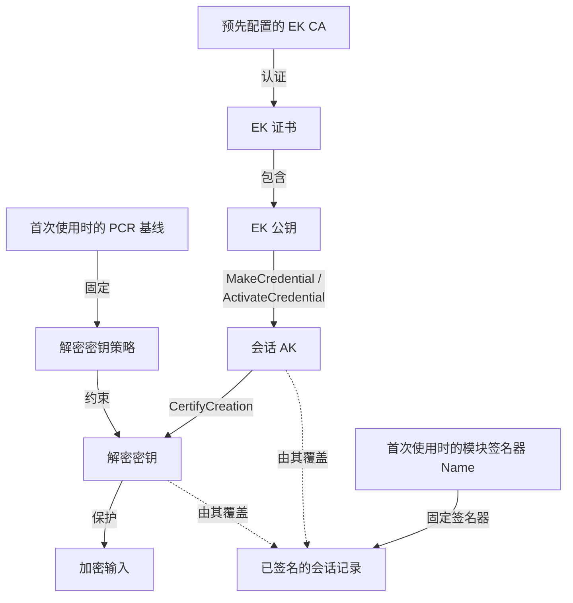
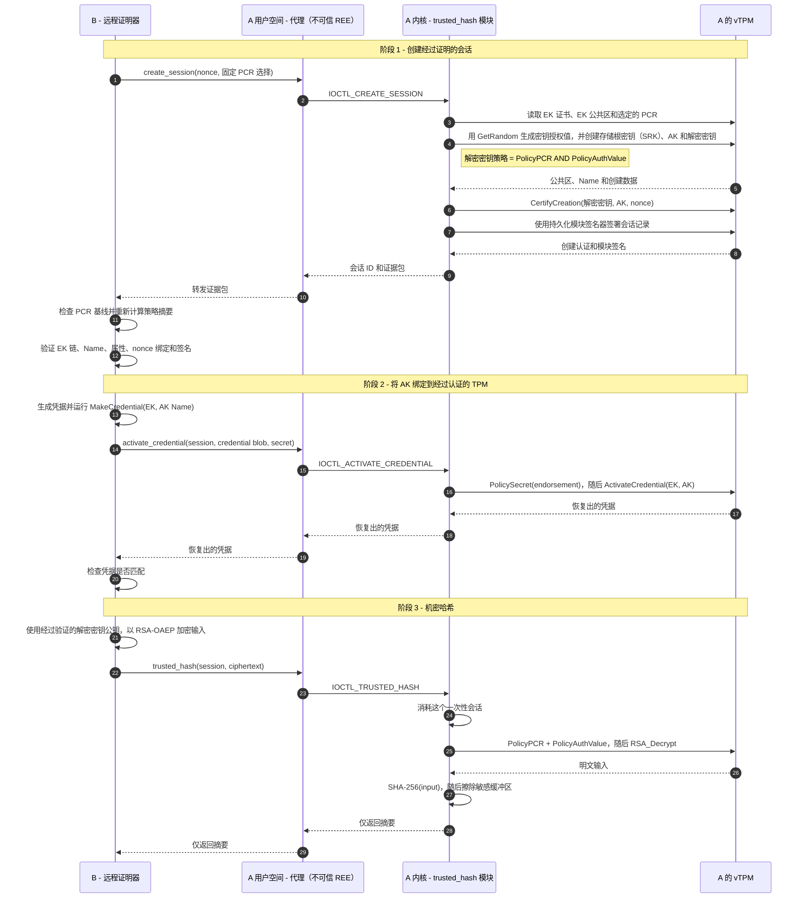

# R3CTF 2026 的 trustedhash：TPM + Linux Lockdown 能否近似实现 TEE？

## 1. 设计动机

大多数软件安全边界都假设机器的所有者是可信的。进程、容器和普通虚拟机可以将不同工作负载彼此隔离，但控制宿主机内核或虚拟机监控器的管理员通常仍能检查或修改它们的内存。加密可以保护静态数据和传输中的数据，但 CPU 要对数据进行计算，最终就必须将其解密。如何保护计算过程中出现的明文，就是**使用中数据（data-in-use）**问题。

**可信执行环境（Trusted Execution Environment，TEE）**旨在提供一个隔离的执行域，即使该域之外的特权软件不可信也能正常工作。它的另一项关键能力是**远程证明（remote attestation）**：TEE 可以生成关于自身身份和初始状态的密码学证据，让远端在释放秘密之前验证将由什么环境来处理它。这些性质使 TEE 适用于机密云工作负载、敏感数据处理，以及在由他人运营的机器上进行密钥处理。

一个常见的消费级示例是 **Google Widevine 数字版权管理（DRM）Level 1**。在受支持的 Android 设备上，内容密钥操作、视频解密和媒体处理会留在硬件支持的 TEE 和受保护媒体路径内，而不是普通 Android 用户空间中。这样一来，流媒体提供商就可以将高价值内容下发到用户控制的手机，而不向普通应用暴露原始密钥或解码后的画面。移动支付授权以及硬件支持的生物识别信息或凭据存储，也是在针对不同类型的秘密应用同一种思路。

它所承诺的实际效果很简单：客户端可以将计算外包出去，却不必同时允许机器所有者访问计算的明文输入。本题探索的是，在没有传统硬件飞地的情况下，我们能否近似实现这一承诺。

这一设计始于一个问题：**在没有专用机密计算硬件的情况下，可信平台模块（TPM）2.0 和 Linux Lockdown 能否提供足够的保护，从而在一台软件和启动生命周期均由攻击者控制的计算机上，构建一个实用的类 TEE 环境？**

攻击者控制的不只是某个正在运行的 Linux 实例的用户空间。从目标计算机的角度看，他们控制着整台机器：拥有 root 权限、控制存储、可以随意重启、可以修改暴露出来的统一可扩展固件接口（UEFI）和 Secure Boot 设置，也可以启动攻击者选择的操作系统。这一范围并不自动包括外部验证器、实现 TPM 的物理层或虚拟化层，以及私有签名材料。

该模型将 Linux 的用户空间/内核权限边界映射到传统的 TEE/REE 划分上。内核空间充当一个粗粒度的**类 TEE 域**，由其中一个已签名的内核组件持有敏感状态并执行机密计算。包括 root 和所有传输代理在内的整个用户空间，都是不可信的**富执行环境（Rich Execution Environment，REE）**。两者通过一个狭窄的内核 API 作为调用边界。

TPM 提供平台身份，在平台配置寄存器（PCR）中记录度量启动状态，并保护使用条件可与该状态绑定的密钥。Linux Lockdown 的 `confidentiality` 模式试图阻止 REE 中的任何用户（包括 root）通过常规内核接口读取或修改内核空间。Secure Boot 在策略启用时限制哪些内容可以启动，而远程证明让验证器能够拒绝由攻击者选择的启动状态。Lockdown 只在受认可的内核运行期间保护 TEE/REE 边界。

这里表达的是一种类比，并非声称它们完全等价：

| 设计 | 隔离边界 / 被排除的攻击者 | 证明目标 | 平台侧 TCB |
| --- | --- | --- | --- |
| TPM + Secure Boot + Lockdown | 将受认可的整个 Linux 内核作为边界；仅排除 root 用户空间。RAM 没有受到单独保护。 | 度量启动状态和 TPM 支持的密钥属性，而非持续的运行时行为。 | 固件、启动链、签名机构、TPM、整个内核以及可信内核组件。 |
| Intel Software Guard Extensions（SGX） | 进程级飞地；操作系统内核和虚拟机监控器均可不受信任。 | 飞地代码身份和签名者。 | CPU、微码、引用基础设施以及飞地代码。 |
| Intel Trust Domain Extensions（TDX） | 整个机密虚拟机；宿主机内核和虚拟机监控器（VMM）均可不受信任。 | 信任域的初始状态和可在运行时扩展的状态。 | CPU、微码、TDX 模块、客户机固件、客户机内核以及工作负载。 |
| AWS Nitro Enclaves | 独立的飞地虚拟机；父实例中的 root 位于边界之外。 | 飞地镜像身份和度量值。 | Nitro 硬件、固件、虚拟机监控器以及飞地代码。 |
| Android Virtualization Framework（AVF）受保护虚拟机 | 受保护虚拟机（pVM）；Android 宿主机内核位于边界之外。 | 受保护的载荷和平台身份。 | 硬件、受保护的基于内核的虚拟机（pKVM）、pVM 固件以及客户机软件。 |

上表只列出了这些设计之间各不相同的平台侧 TCB。对于任何远程秘密释放协议，验证器、它的信任锚和证明策略也都是端到端 TCB 的组成部分。可用性、侧信道和不可信 I/O 则始终是这些设计需要另行考虑的问题。

### 1.1 必需的假设与可信计算基

**可信计算基（Trusted Computing Base，TCB）**是指一旦遭到破坏，就可能使机密性或真实性保证失效的全部组件。内核侧执行域只是一个庞大得多的 TCB 中的一部分。这一构造需要以下假设：

1. **A1——内存隔离：**明文和授权值可能存在于普通 DRAM 中。由于攻击者可以随时重启，敏感内存必须在另一个执行环境启动前被清除，或者以其他方式确保后者无法访问。攻击者不能探测或转储物理内存，也不能通过直接内存访问（DMA）或宿主机访问它。
2. **A2——内核边界：**预期的 Linux 内核和可信组件正在运行，Lockdown 的 `confidentiality` 模式得到了正确执行，包括 root 在内的用户空间无法读取或修改内核内存。相关内核路径中不能存在绕过这一边界的漏洞。
3. **A3——启动与签名链：**Secure Boot、签名强制检查和 PCR 度量覆盖了所有与安全相关的启动状态。修改 UEFI 设置或启动另一个操作系统时，必须产生会被验证器拒绝的证据。固件、受认可的基线、签名密钥和密钥授权材料必须保持可信和机密。
4. **A4——TPM 与平台：**TPM 正确实现密钥不可导出性、授权、PCR、密封和证明语义。如果使用虚拟 TPM（vTPM），其虚拟机监控器和后端实现也必须可信。
5. **A5——远程验证器：**验证器的信任锚、PCR 基线、新鲜度检查、证据绑定和加密逻辑都是正确且未遭破坏的。

在这些假设下，即使攻击者控制着 REE 和计算机的启动生命周期，TPM + Lockdown 也可以让内核空间在一次受认可的启动期间充当实用的类 TEE 域。但它无法提供 SGX、TDX、Nitro Enclaves 或 AVF 受保护虚拟机那样由硬件强制实现的隔离。

## 2. 题目设置

完整的题目源码、部署配置和本地复现工具链可在
[starcatmeow/trustedhash](https://github.com/starcatmeow/trustedhash) 中获取。

### 2.1 最小化的机密计算工作负载

本题的目的是测试 TEE 构造本身，而不是将复杂性藏在工作负载里。因此，我们选择了最小且有意义的机密计算：远程客户端提供字符串 `m`，并要求类 TEE 环境返回 `SHA-256(m)`，同时不向控制这台计算机的攻击者泄露 `m`。在实际部署的题目中，`m` 就是当前的动态 flag。

远端当然可以自己计算这个哈希。这是有意为之：哈希运算是机密性和证明路径的测试向量，并不是说远程哈希本身是一种有实际用途的外包服务。安全目标是让机器 A 的用户空间只能看到证明证据、加密输入和最终摘要。输入明文在 A 上应当只存在于 TPM/内核模块路径内部。

实现中共有四个角色：

- **机器 B / `trusted-hash-attester`** 是可信的。它持有输入字符串、背书密钥（Endorsement Key，EK）证书的信任锚，以及受认可的证明基线。只有在验证成功后，它才会释放加密输入。
- **`trusted-hash-agent`** 运行在 A 的不可信用户空间中。它将网络消息转换为对 `/dev/trusted_hash` 的 ioctl 调用，并转发响应。即使它遭到破坏，也不能泄露明文或授权伪造的计算。
- **`trusted_hash` 内核模块**是类 TEE 工作负载。它持有每个会话的授权值、构造 TPM 证据、请求解密、计算 SHA-256，并且只返回摘要。
- **每位选手独立的 vTPM** 提供 EK、新生成的证明密钥（Attestation Key，AK）和会话密钥，以及策略执行、认证和持久化的模块签名器身份。其状态和后端不受选手控制。

### 2.2 信任绑定

在逐条分析 TPM 消息之前，先明确验证器需要该协议证明什么会更有帮助。这个构造组合了五种彼此独立的信任关系：

- **启动状态绑定：**B 使用固定的 SHA-256 PCR 选择 `[0, 2, 4, 7, 11, 14]`，将返回的组合 PCR 摘要与固定基线比较，并独立重新计算预期的 `PolicyPCR + PolicyAuthValue` 摘要。解密密钥必须恰好带有这一 `authPolicy`。
- **平台与 AK 绑定：**预先配置的 EK 证书颁发机构（CA）认证 EK 证书，而 B 检查证书公钥是否与返回的 EK 公共区匹配。随后，`MakeCredential`/`ActivateCredential` 证明该会话 AK 可以与同一个 vTPM 中的这个 EK 一起使用。
- **AK 与解密密钥绑定：**B 重新计算 AK 和解密密钥的 TPM Name，验证它们的准确属性，并检查 AK 的 `CertifyCreation` 签名。验证器 nonce 被作为限定数据包含在内，从而将认证与当前会话绑定。
- **内核模块绑定：**一个持久化的 TPM 模块签名器会对一份记录进行签名，其中包含 nonce、PCR 选择和摘要、策略摘要、AK 与解密密钥的公共区和 Name，以及创建认证。B 固定了签名器的 TPM Name，因此不应将不可信用户空间直接创建的 TPM 证据接受为内核生成的证据。
- **机密数据路径：**只有当每项检查以及凭据激活的往返流程全部成功后，B 才会使用经过验证的解密密钥加密输入。该密钥的私有授权值保存在内核会话状态中，而 TPM 解密还需要满足选定的 PCR 状态。用户空间代理只能看到密文和最终摘要。

因此，预期的信任链如下：



其中任何一条边单独存在都不够。特别是，证明一个密钥属于正确的 TPM，并不能证明可信内核模块创建或控制了它；这就是设计中还需要一份独立的模块签名器记录的原因。

### 2.3 端到端证明与计算流程



创建会话的响应中包含 EK 证书和公共区、新生成的 AK、新生成的解密密钥、选定 PCR 的摘要及其派生策略、AK 为解密密钥提供的创建认证，以及持久化模块签名器的签名。在所有检查完成之前，B 都将每一个字段视为由攻击者控制。

### 2.4 为什么必须使用 `authValue`

PCR 策略约束的是*平台状态*，而不是*哪个调用者*可以使用某个 TPM 对象。PCR 值并不是秘密，在同一次受认可的启动中，所有与 TPM 通信的进程看到的值都相同。如果解密密钥只受 `PolicyPCR` 保护，那么一旦该对象可被寻址，该策略就无法通过密码学手段区分内核模块和恶意用户空间。用户空间可以打开 TPM 设备，复现相同的策略会话，然后直接请求解密。Lockdown 可以保护内核内存，但它不会让 TPM 命令接口由内核模块独占。

因此，解密密钥同时要求 `PolicyPCR` 和 `PolicyAuthValue`。在 `create_session` 期间，模块从 TPM 随机数生成器（RNG）获得一个全新的 32 字节 `key_auth`，将其放入解密密钥的敏感区，并且只在内核会话状态中保留一个副本。在 `trusted_hash` 期间，模块执行 `PolicyAuthValue`，并使用该秘密授权 `TPM2_RSA_Decrypt`。用户空间可能知道 PCR 值、解密密钥公共区和密文，但没有 `key_auth` 就无法完成授权。PCR 条件将密钥绑定到受认可的机器状态，而 `authValue` 将密钥的使用权绑定到持有秘密的内核模块。

持久化模块签名器出于另一个目的使用了相同思路。它的长期 `authValue` 用来授权对会话证据的签名，防止用户空间要求 TPM 签名器为攻击者创建的 AK 和解密密钥背书。在两次启动之间，这个值存储在句柄为 `0x81010021` 的已密封 TPM 对象中。在一次可信启动的早期，模块依据预期的 PCR 策略将其解封，随后扩展 PCR 14，在普通用户空间启动前关闭可解封状态。正常运行时，签名器授权值只存在于内核内存和受 TPM 保护的对象内部。

因此，内核与 TPM 之间共享着两个生命周期不同的秘密：

- **模块签名器 `authValue`** 是长期秘密，用于保护证明证据的来源；
- **解密密钥 `authValue`** 在每个会话中重新生成，用于保护最终的解密操作。

两者共同维持了贯穿整个协议的预期不变量：用户空间可以直接发出 TPM 命令，但在取得本应只存在于内核/TPM 边界内部的秘密之前，它既无法冒充模块签名器，也无法恢复机密输入。

### 2.5 首次使用信任

提前预测每个 PCR 值并不方便，尤其是统一内核镜像（Unified Kernel Image，UKI）、固件度量、每位选手独立的 Secure Boot 状态和模块初始化都会影响最终结果。因此，portal 在为每位选手配置环境时采用**首次使用信任（Trust on First Use，TOFU）**。operator 创建 VM、vTPM、Secure Boot 状态和 EK 证书链，然后在不向选手开放的私有模式下启动一次 VM。在这次首次可信启动期间，内核模块会初始化持久化签名器和 PCR 14 棘轮。portal 记录最终的 PCR 基线和模块签名器 TPM Name，随后将同一份 VM 状态以公开模式重新启动。

证明流程会度量 SHA-256 PCR `[0, 2, 4, 7, 11, 14]`：

- **PCR 0：**建立度量启动链的核心 UEFI 固件和度量信任根核心（Core Root of Trust for Measurement，CRTM）代码。
- **PCR 2：**在操作系统启动应用之前加载的 UEFI 驱动和 option ROM 代码。
- **PCR 4：**EFI 启动应用代码。在这一环境中，它包括从 `EFI/BOOT/BOOTX64.EFI` 加载的已签名 UKI。
- **PCR 7：**Secure Boot 策略和授权状态，包括用来接受 UKI 的平台密钥数据库。
- **PCR 11：**由 `systemd-stub` 度量的 UKI 载荷段，包括内嵌的内核、内核命令行和 initrd。initrd 中包含 `trusted_hash` 模块。
- **PCR 14：**由题目定义的模块棘轮。取得持久化签名器授权值后，模块会将一个固定且经过域分离的值扩展进 PCR 14，以此标记可信模块已成功完成身份初始化，并关闭扩展前的解封状态。

PCR 14 并不直接对模块二进制文件做哈希。该模块已经位于已签名 UKI/initrd 的信任路径中；PCR 14 记录的是可信模块在本次启动期间已经到达预期的身份初始化阶段。

后续证明同时要求相同的 PCR 基线和相同的模块签名器 Name。EK 根证书和颁发者证书由 operator 单独配置。因此，TOFU 假设这次私有的首次启动可信，但也避免了要求 operator 离线计算所有预期度量值。

## 3. 预期解法：打破内存隔离假设

至此，这一构造看起来已经相当可信。验证器会检查特定的启动状态；输入被加密给一个同时要求正确 PCR 和内核所持 `authValue` 的 TPM 密钥；持久化模块签名器则将会话证据绑定到可信内核组件。不存在某个显而易见、可以直接替换或省略的密码学字段。

但这一结论能有多可靠，完全取决于第 1.1 节中的假设有多可靠。在本题中，A3 至 A5 基本由 operator 控制：签名材料和受认可的启动组件配置在选手 VM 之外，vTPM 后端不向选手开放，远程验证器也与 A 隔离。它们仍是 TCB 的组成部分，但并不是很有希望的选手侧攻击面。A1 和 A2 更加脆弱，因为它们涉及一台 root 用户和启动生命周期都被有意交给选手控制的机器内部的行为。

### 3.1 为什么内核边界起初看起来足够安全

我们最初对 A2（内核边界假设）的判断是，Linux Lockdown 的 `confidentiality` 模式应当能够阻止包括 root 在内的用户空间通过常规采集接口读取内核内存。[AVML](https://github.com/microsoft/avml) 一类工具无法直接无视内核的访问策略。原始物理内存、内核核心镜像、调试设施和可加载的未签名代码等接口，要么受 Lockdown 限制，要么在题目镜像中被单独禁用。

[Neodyme 对 BitLocker 的研究](https://neodyme.io/en/blog/bitlocker_screwed_without_a_screwdriver/#step-3a-finding-a-way-around-lockdown-mode)似乎也支持这一直觉：其读取原始内存的路径首先需要一个内核漏洞来绕过 Lockdown。因此很容易得出这样的判断：如果内核是最新版本，选手就需要一个合适的 0-day 才能突破用户空间/内核边界。

这样的判断过于乐观。Lockdown 移除了危险的内核接口，但它只是由同一个庞大内核实现的加固策略，而这个内核本身也位于我们的 TCB 中；它既不是形式化的无干扰保证，也不是独立的硬件边界。后文介绍的非预期解法证明，实际上无需新的内核 0-day 就能打破 A2。不过，预期解法并没有破坏这条边界，而是转而攻击 A1。

### 3.2 客户机重启并不等于断电重启

A1 要求敏感 DRAM 不能被攻击者控制的执行环境读取。对于远程夺旗赛（CTF）虚拟机来说，这乍看之下也很合理。选手无法打开服务器并连接物理内存探针，而 Lockdown 会阻止普通 root 进程在可信 Linux 启动环境中使用内存采集工具。

被忽略的细节在于，攻击者控制着接下来启动的内容。客户机中的 `reboot` 会重置虚拟机，但不会终止 QEMU 进程。在本题环境中，这种重置不会清零 QEMU 中作为客户机 RAM 后端的内存。固件和下一个载荷在启动过程中会覆盖一部分页面，但上一个内核的大量内存仍然可用。因此，即使没有任何 Linux 接口暴露过这些内存，攻击者控制的 UEFI 应用仍然可以访问客户机残留的物理内存。这相当于一次针对内存残留的冷启动攻击，只不过发生在热重启过程中。

题目附加了一块持久化备用磁盘 `/dev/vdb`，因此完整的内存采集路径如下：

1. 在正常 Linux 系统中，将备用磁盘格式化为 FAT 文件系统。把可启动的 [UEFI Shell](https://github.com/pbatard/UEFI-Shell) 安装为 `EFI/BOOT/BOOTX64.EFI`，并将 [Memory-Dump-UEFI](https://github.com/NoInitRD/Memory-Dump-UEFI) 放到同一块磁盘上。
2. 重启客户机，通过 VNC 进入 UEFI 配置，禁用 Secure Boot，然后从备用磁盘启动 UEFI Shell。
3. 运行 `MemoryDump.efi`，将物理内存镜像写回备用磁盘。必须在固件活动覆盖有用页面之前完成这一步。
4. 再次重启，重新启用 Secure Boot，并从第一块磁盘启动原始的已签名 UKI。

未签名的内存转储环境自然会产生错误的 PCR 值，但它运行时不会请求任何证明。下一次启动时，PCR 会再次重置并扩展。恢复 Secure Boot 并加载原始 UKI 后，A 就会回到 B 所接受的基线。TPM 证明描述的是当前的度量启动，而不是一份只能追加的历史记录；它无法证明在两次可信启动之间从未运行过攻击者控制的系统。

### 3.3 恢复模块签名器的 `authValue`

内存转储中最有价值的目标并不是生命周期很短的会话解密密钥，而是持久化模块签名器的 32 字节 `authValue`。这个值在配置阶段生成；在之后的每次可信启动中，模块都会从 TPM 将其解封，并在内核的整个生命周期内将其保存在静态数组 `module_signer_auth` 中。该值可以授权句柄为 `0x81010020` 的持久化签名器执行 `TPM2_Sign`。客户机重置前它不会被擦除；又因为它属于持久化签名器，恢复原始操作系统的启动后，提取出的值仍然有效。密封可以保护 TPM 内部静态存储的副本，却无法召回已经释放到 DRAM 中的明文副本。

在 RAM 镜像中寻找一个未知的 32 字节随机字符串本来会很困难，但相邻的模块状态为我们提供了一个公开锚点。合法的 `create_session` 响应中包含持久化签名器的 TPM Name。同一个 Name 也存储在模块静态数据的 `module_identity.signer_name` 中。使用 `readelf` 可以确定对应版本 `trusted_hash.ko` 中 `module_identity` 和 `module_signer_auth` 符号的位置。随后可以根据源码布局确定 `module_identity` 内部 `signer_name` 字段的位置。由于两个对象都位于模块的 `.bss` 段中，即使模块在运行时发生了重定位，它们在这个构建版本中的相对偏移也保持不变。

因此，我们可以取得 `create_session` 以十六进制形式提供的签名器 Name，直接在内存转储中搜索对应的二进制序列，再应用 `.bss` 内的相对偏移，得到 32 字节 `module_signer_auth` 的位置。这种基于内容的锚点不要求我们知道模块的绝对运行时地址。

### 3.4 用用户空间冒牌程序替换内核模块

泄露这个授权值并不会从 TPM 中导出模块签名器的私钥，但它带来了同样有用的能力：普通用户空间进程可以要求真正的持久化签名器为任意会话记录签名。此时，模块签名已无法证明记录中描述的密钥是由内核模块创建的；它只能证明调用者知道泄露出来的持有者秘密。

回到受认可的启动状态后，选手停止真正的 `trusted-hash-agent`，并用一个替代服务监听 31337 端口。该伪造服务直接打开 `/dev/tpmrm0`，复现公开的协议：

1. 处理 `create_session` 时，它读取真正的 EK 证书和持久化签名器公共区，读取受认可的 PCR，并在真正的 vTPM 中创建新的 AK 和 RSA 解密密钥。最关键的是，它会在用户空间中选择并保留解密密钥的每会话 `authValue`。
2. 它创建预期的 `PolicyPCR + PolicyAuthValue` 策略，从 AK 获得真正的 `CertifyCreation` 签名，构造完全一致的模块签名器记录，再使用恢复出的模块签名器 `authValue`，授权句柄 `0x81010020` 执行 `TPM2_Sign`。
3. 它使用真正的 EK 和 AK 完成 `MakeCredential`/`ActivateCredential`。因此，B 看到的是正确的 EK 链、预期的签名器 Name 和 PCR 基线、格式正确的 TPM 对象、有效的创建认证，以及真正的模块签名器签名。
4. B 发送加密输入时，伪造服务重新加载自己的解密密钥，满足 `PolicyPCR`，提供攻击者已知的密钥 `authValue`，并要求 TPM 解密。此时明文 flag 会被返回到用户空间。服务将其打印出来，再向 B 发送 `SHA-256(flag)`，使外部协议仍能正常完成。

整个过程不需要在密码学意义上伪造任何 TPM 原语或验证器检查。攻击者在当前的可信启动中创建内部完全有效的证据，再利用泄露的授权值，让攻击者控制的会话密钥看起来像是由内核控制的密钥。这打破了从固定的模块签名器到新生成的解密密钥之间最核心的信任边。

更广泛的教训是，回到正确的 PCR 状态并不能撤销先前启动期间已经泄露的秘密。此类构造必须在攻击者控制的软件层之下强制清除内存，阻止另一个执行环境观察残留 RAM，或者使用受硬件保护的内存。在内核中正常擦除这个值可以作为有用的纵深防御，但攻击者可以在清理代码运行前强制重置时，这还远远不够。

## 4. 非预期解法与复盘

比赛结束后，选手公开了至少两种不使用热重启内存转储的解法。它们都没有攻破密码学原语或验证器检查，而是攻击了周围庞大的 TPM/Linux 集成面中截然不同的部分。其中一种利用 Linux 的扩展伯克利包过滤器（eBPF）插桩，另一种则操纵 TPM 资源状态。

### 4.1 使用 eBPF fentry 读取 SHA-256 上下文

在 [W4llz 的题解](https://github.com/hax1ng/r3ctf-2026-writeups/blob/master/pwn/TrustedHash.md)中，第一次成功的本地实验使用了一个自定义内核模块，在 `tpm2_rsa_decrypt()` 上设置 kretprobe。这样可以轻易捕获明文，但生产环境中的 Lockdown 正确拒绝了未签名模块。通过 `/dev/mem` 或 `/proc/kcore` 直接读取、不安全的 kprobe 和 perf 路径、原始 TPM 总线访问，以及 `bpf_probe_read_kernel()` 一类辅助函数也都无法使用。

突破点在于不再以 TPM 输出缓冲区为目标。解密后，`trusted_hash()` 会立即执行：

```c
sha256_init(&hash_ctx);
sha256_update(&hash_ctx, plaintext, plaintext_size);
sha256_final(&hash_ctx, req->result);
```

对于较短的输入，`sha256_update()` 会把尚待处理的输入字节留在 `struct sha256_ctx` 内部的 64 字节分组缓冲区里。因此，在进入 `sha256_final()` 时，内核栈上的上下文中仍然留有完整 flag 的副本。稍后擦除原始的 `plaintext` 分配并不会删除这第二份仍然存在的副本。

VM 通过 `/sys/kernel/btf/vmlinux` 暴露了内核 BPF 类型格式（BTF）元数据，而且 root 仍然可以使用特权 BPF。eBPF fentry 程序可以直接附加到 `sha256_final()`，并接收其带 BTF 类型信息的 `struct sha256_ctx *` 参数。BPF 验证器允许直接从这个参数进行带类型的读取，因此程序无需调用受 Lockdown 限制的 `bpf_probe_read_kernel()` 辅助函数，就可以将上下文复制到 BPF map 中。随后，用户空间读取该 map，并在捕获到的 64 字节缓冲区中搜索 `r3ctf{`。

这就是第 3.1 节所述 A2 的具体反例。它既不需要未签名模块，也不需要内核 0-day。一个受支持且由 root 控制的插桩机制，就足以在精心选择的内核函数边界上观察到秘密。真正的代理和 TPM 流程可以保持不变，而 eBPF 程序只需等待周期性的 flag 请求。

### 4.2 耗尽 TPM 会话以阻止 PCR 14 关闭

[C4T BuT S4D 战队的 keltecc](https://blog.kelte.cc/posts/r3ctf-2026-trustedhash/)发现了 PCR 14 棘轮中的另一个弱点。句柄为 `0x81010021` 的已密封对象包含模块签名器的 `authValue`，并且只受扩展前的 PCR 策略保护。正常启动时，模块会启动一个策略会话，解封该值，然后扩展 PCR 14。用户空间启动得太晚，无法复现先前的 PCR 状态。

这种靠前的执行顺序是刻意设计的。`trusted_hash.ko` 被包含在已签名 UKI 内部的 initrd 中，并且会在 initrd 阶段、普通用户空间启动之前加载。因此，选手无法在保留受认可启动状态的同时简单地阻止该模块：修改 UKI 或其 initrd 会使 Secure Boot 签名失效，禁用 Secure Boot 会改变 PCR 7，而修改内核命令行来调整早期模块加载则会改变 PCR 11 的度量值。验证器会拒绝上述每一种状态。

但这套棘轮隐含假设了模块初始化总能执行到扩展操作，而 TPM 的会话容量让攻击者能够控制这一假设是否成立。Kelte 的解法保留了已签名 UKI、命令行和早期模块加载尝试；相反，它让真正的初始化过程在一个精心选择的 TPM 操作上失败。攻击过程如下：

1. 卸载 `trusted_hash`，然后不断创建并保存 TPM 策略会话，直到 swtpm 的会话/上下文槽位被耗尽。已保存会话的记录会持久化到 vTPM 状态中。
2. 使用 portal 提供的 VM 重启操作。这会重启 QEMU 和 swtpm，使新一次启动获得全新的 PCR，同时保留已被耗尽的持久化 TPM 状态。
3. initrd 启动期间，`trusted_hash` 会读取持久化对象，但在尝试分配自己的策略会话时失败。模块初始化在解封秘密之前返回错误，更关键的是，也发生在扩展 PCR 14 之前。操作系统的其余部分仍会继续启动。
4. 在用户空间中清除已保存的会话，恢复 TPM 容量。此时 PCR 14 仍为零，而其他被选中的 PCR 描述的是预期的已签名启动状态。用户空间策略会话现在可以满足 `0x81010021` 上存储的准确策略，并解封模块签名器 `authValue`。

这使资源耗尽故障转化成了机密性故障。先解封、再关闭的设计不具备失败原子性：如果之前的某条 TPM 命令失败，系统仍然可用，但密封状态也仍然开放。

恢复出的值是长期有效的。攻击者可以在不耗尽会话的情况下再重启一次，让模块正常初始化，使 PCR 14 回到验证器所接受的值。干净启动并不能撤销已经恢复出的签名器授权值。Kelte 还发现，当前会话 AK 的 `authValue` 为空，因此替代代理或中间人代理可以使用它为攻击者创建的解密密钥提供认证。取得模块签名器秘密后，攻击者可以签署修改过的记录，让 flag 被加密给这个密钥，并在用户空间中将其解密。

与预期解法相同，所有由外部检查的 TPM 证据都可以是真实的。弱点存在于模块初始化、TPM 资源限制、PCR 状态和失败处理的组合方式中。

### 4.3 结语

这些解法说明了为什么很难把 TPM + Linux Lockdown 当作一种通用 TEE。相关攻击面不仅包括 TPM 密码学和验证器，还包括完整的内核配置、特权 eBPF 和 BTF 语义、内核密码学代码产生的每一份临时副本、模块生命周期、TPM 资源管理器、持久化 vTPM 行为、重置语义，以及解封秘密和关闭策略状态之间的每一条错误路径。

两种非预期解法利用的并不是同一个错误。一种使用合法的内核插桩功能跨越预期的机密性边界；另一种使用 TPM 资源耗尽来阻止安全状态转换。考虑到这套组合攻击面的规模和复杂性，我相信本题很可能还存在许多其他非预期解法。这并不意味着度量启动或 Lockdown 毫无用处，但它进一步凸显了二者与专用硬件强制 TEE 边界之间的差异。

感谢每一位参与本题的选手，尤其感谢赛后分享详细题解的选手。也感谢 r3kapig 组织 R3CTF 2026。设计本题并研究各种解法的过程，让我对 TPM 2.0、Linux Lockdown、eBPF、BTF，以及简洁安全模型与完整实现攻击面之间的差距有了深刻得多的理解。
