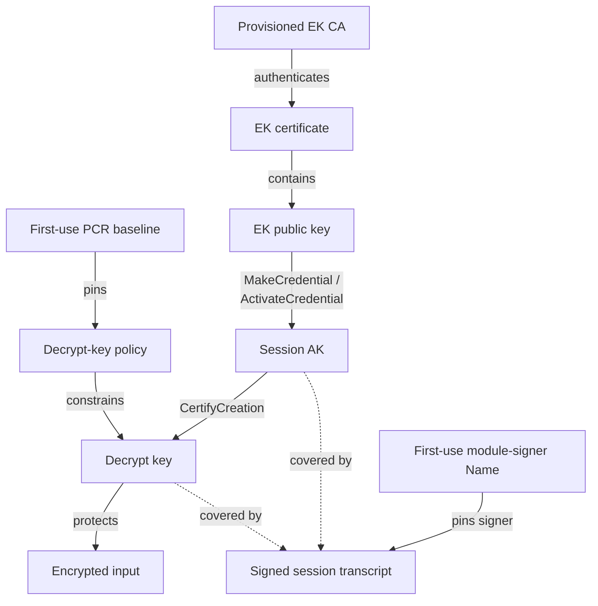
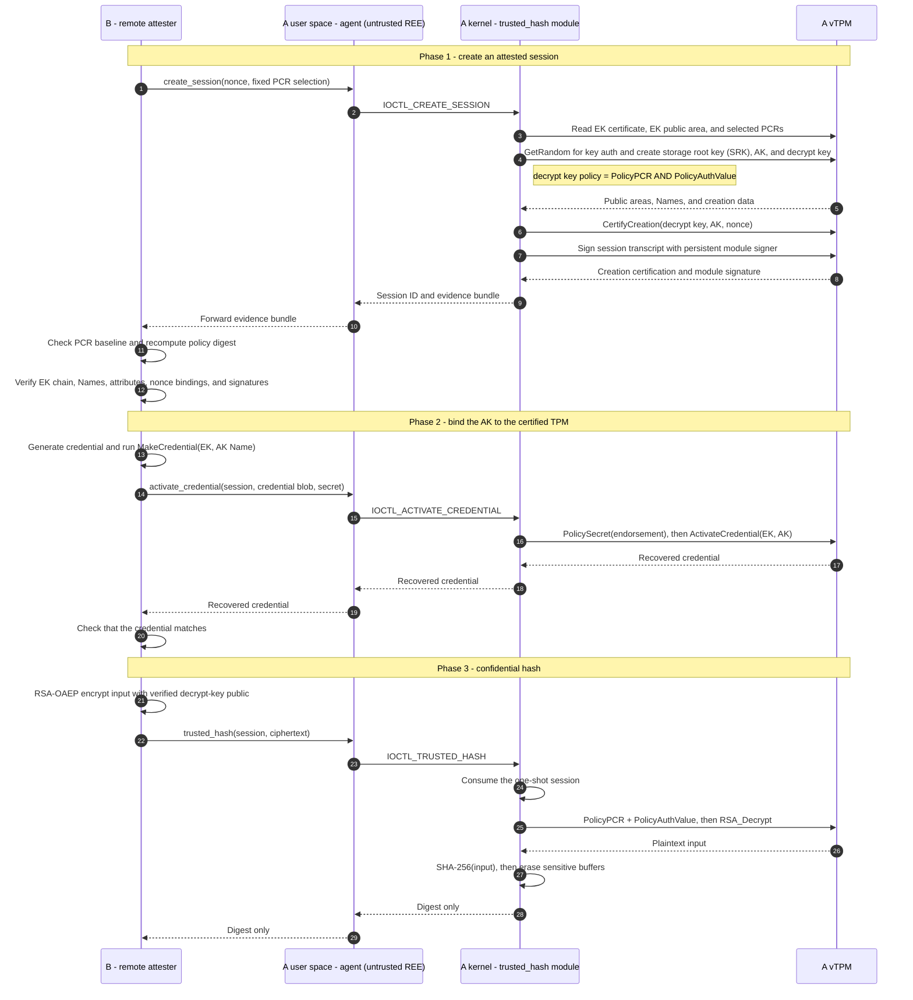

# trustedhash at R3CTF 2026: Can TPM + Linux Lockdown Approximate a TEE?

## 1. Design Motivation

Most software security boundaries assume that the owner of the machine is
trusted. Processes, containers, and ordinary virtual machines can isolate one
workload from another, but an administrator controlling the host kernel or
hypervisor can normally inspect or modify their memory. Encryption protects
data at rest and in transit, but the data must eventually be decrypted for the
CPU to compute on it. Protecting this plaintext while it is being processed is
the **data-in-use** problem.

A **Trusted Execution Environment (TEE)** is designed to provide an isolated
execution domain even when privileged software outside that domain is not
trusted. Its other essential capability is **remote attestation**: the TEE can
produce cryptographic evidence about its identity and initial state, allowing
a remote party to verify what will handle a secret before releasing it. These
properties make TEEs useful for confidential cloud workloads, sensitive data
processing, and key handling on machines operated by somebody else.

A familiar consumer example is **Google Widevine Digital Rights Management
(DRM) Level 1**. On a supported Android device, content-key operations, video
decryption, and media processing remain inside a hardware-backed TEE and
protected media path rather than ordinary Android user space. This lets a
streaming provider release high-value content to a user-controlled phone
without exposing the raw keys or decoded frames to normal applications. Mobile
payment authorization and hardware-backed biometric or credential storage
apply the same general idea to different types of secrets.

The practical promise is simple: a client can outsource a computation without
also granting the machine owner access to its plaintext inputs. This challenge
explores whether we can approximate that promise without a conventional
hardware enclave.

This design starts with one question: **without dedicated confidential-
computing hardware, can a Trusted Platform Module (TPM) 2.0 and Linux Lockdown
provide enough protection to build a useful TEE-like environment on a computer
whose software and boot lifecycle are controlled by an attacker?**

The attacker controls more than the user space of one running Linux instance.
From the target computer's point of view, they control the whole machine: they
have root, control its storage, can reboot at will, can change exposed Unified
Extensible Firmware Interface (UEFI) and Secure Boot settings, and can boot an
attacker-chosen operating system. This scope does not automatically include the
external verifier, the physical or virtualization layer implementing the TPM,
or private signing material.

The model maps the Linux user/kernel privilege boundary onto the conventional
TEE/REE split. Kernel space acts as a coarse-grained **TEE-like domain** in
which a signed kernel component holds sensitive state and performs confidential
computation. All user space, including root and any transport proxy, is the
untrusted **Rich Execution Environment (REE)**. A narrow kernel API forms the
call boundary between them.

The TPM supplies a platform identity, records measured boot state in Platform
Configuration Registers (PCRs), and protects keys whose use can be tied to that
state. Linux Lockdown in `confidentiality` mode attempts to prevent even root
in the REE from reading or modifying kernel space through ordinary kernel
interfaces. Secure Boot constrains what can start while its policy is enabled,
while remote attestation allows a verifier to reject an attacker-chosen boot
state. Lockdown protects the TEE/REE boundary only while the accepted kernel is
running.

This is an analogy rather than a claim of equivalence:

| Design | Isolation boundary / attacker excluded | Attestation target | Platform-side TCB |
| --- | --- | --- | --- |
| TPM + Secure Boot + Lockdown | The accepted Linux kernel as a whole; excludes root user space only. RAM is not separately protected. | Measured boot state and TPM-backed key properties, not continuous runtime behavior. | Firmware, boot chain, signing authorities, TPM, whole kernel, and trusted kernel components. |
| Intel Software Guard Extensions (SGX) | A process-level enclave; the operating-system kernel and hypervisor may be untrusted. | Enclave code identity and signer. | CPU, microcode, quoting infrastructure, and enclave code. |
| Intel Trust Domain Extensions (TDX) | An entire confidential VM; the host kernel and Virtual Machine Monitor (VMM) may be untrusted. | Initial and runtime-extensible state of the Trust Domain. | CPU, microcode, TDX module, guest firmware, guest kernel, and workload. |
| AWS Nitro Enclaves | A separate enclave VM; root in the parent instance is outside the boundary. | Enclave image identity and measurements. | Nitro hardware, firmware, hypervisor, and enclave code. |
| Android Virtualization Framework (AVF) protected VM | A protected VM (pVM); the Android host kernel is outside the boundary. | Protected payload and platform identity. | Hardware, protected Kernel-based Virtual Machine (pKVM), pVM firmware, and guest software. |

The table lists only the platform-side TCB that differs between these designs.
For every remote secret-release protocol, the verifier, its trust anchors, and
its attestation policy are also part of the end-to-end TCB. Availability, side
channels, and untrusted I/O remain separate concerns across these designs.

### 1.1 Required Assumptions and Trusted Computing Base

The **Trusted Computing Base (TCB)** is the set of components whose compromise
could invalidate the confidentiality or authenticity claim. The kernel-side
execution domain is only one component of a much larger TCB. This construction
requires the following assumptions:

1. **A1 - Memory isolation:** plaintext and authorization values may exist in
   ordinary DRAM. Because the attacker can reboot at will, sensitive memory
   must be scrubbed before another execution environment starts, or otherwise
   remain inaccessible to it. The attacker must not be able to probe or dump
   physical memory or access it through Direct Memory Access (DMA) or the host.
2. **A2 - Kernel boundary:** the expected Linux kernel and trusted components
   are running, Lockdown `confidentiality` mode is correctly enforced, and user
   space, including root, cannot read or modify kernel memory. Relevant kernel
   paths must not contain a vulnerability that bypasses this boundary.
3. **A3 - Boot and signing chain:** Secure Boot, signature enforcement, and PCR
   measurements cover all security-relevant boot state. Changing UEFI settings
   or booting another operating system must produce evidence that the verifier
   rejects. Firmware, accepted baselines, signing keys, and key authorization
   material remain trustworthy and confidential.
4. **A4 - TPM and platform:** the TPM correctly implements key
   non-exportability, authorization, PCR, sealing, and attestation semantics. If
   a virtual TPM (vTPM) is used, its hypervisor and backing implementation are
   trusted as well.
5. **A5 - Remote verifier:** the verifier's trust anchors, PCR baselines,
   freshness checks, evidence bindings, and encryption logic are correct and
   uncompromised.

Under these assumptions, TPM + Lockdown can make kernel space serve as a useful
TEE-like domain during an accepted boot, even when the attacker controls the
REE and the computer's boot lifecycle. It does not provide the same
hardware-enforced isolation as SGX, TDX, Nitro Enclaves, or AVF protected VMs.

## 2. Challenge Setup

The complete challenge source, deployment configuration, and local
reproduction toolchain are available in
[starcatmeow/trustedhash](https://github.com/starcatmeow/trustedhash).

### 2.1 A Minimal Confidential-Compute Workload

The purpose of this challenge is to test the TEE construction itself, not to
hide complexity inside the workload. We therefore chose the smallest useful
confidential computation: a remote client supplies a string `m` and asks the
TEE-like environment to return `SHA-256(m)` without revealing `m` to the
attacker controlling the computer. In the hosted challenge, `m` is the
current dynamic flag.

The remote side could of course compute this hash itself. That is intentional:
the hash operation is a test vector for the confidentiality and attestation
path, rather than a claim that remote hashing is a useful outsourced service.
The security goal is that machine A's user space sees only attestation
evidence, an encrypted input, and the final digest. The input plaintext should
exist on A only inside the TPM/kernel-module path.

The implementation has four roles:

- **Machine B / `trusted-hash-attester`** is trusted. It holds the input
  string, the Endorsement Key (EK) certificate trust anchors, and the accepted
  attestation baselines. It releases the encrypted input only after
  verification succeeds.
- **`trusted-hash-agent`** runs in A's untrusted user space. It translates
  network messages into ioctls on `/dev/trusted_hash` and forwards the
  responses. Its compromise must not reveal the plaintext or authorize a fake
  computation.
- **The `trusted_hash` kernel module** is the TEE-like workload. It owns
  the per-session authorization values, constructs TPM evidence, requests
  decryption, computes SHA-256, and returns only the digest.
- **The per-player vTPM** provides the EK, fresh Attestation Keys (AKs) and
  session keys, policy enforcement, certification, and the persistent
  module-signer identity. Its state and backend remain outside player control.

### 2.2 Trust Bindings

Before following the individual TPM messages, it helps to state what the
verifier needs the protocol to prove. The construction composes five separate
trust relationships:

- **Boot-state binding:** B uses the fixed SHA-256 PCR selection
  `[0, 2, 4, 7, 11, 14]`, compares the returned combined PCR digest with its
  pinned baseline, and independently recomputes the expected
  `PolicyPCR + PolicyAuthValue` digest. The decrypt key must carry exactly that
  `authPolicy`.
- **Platform and AK binding:** the provisioned EK Certification Authority (CA)
  authenticates the EK certificate, and B checks that the certificate public
  key matches the returned EK public area. `MakeCredential`/`ActivateCredential`
  then proves that the session AK is usable with that EK in the same vTPM.
- **AK and decrypt-key binding:** B recomputes the TPM Names of the AK and
  decrypt key, verifies their exact attributes, and checks the AK's
  `CertifyCreation` signature. The verifier nonce is included as qualifying
  data, binding the certification to the current session.
- **Kernel-module binding:** a persistent TPM module signer signs a transcript
  containing the nonce, PCR selection and digest, policy digest, AK and decrypt
  key public areas and Names, and creation certification. B pins the signer's
  TPM Name, so TPM evidence created directly by untrusted user space should not
  be accepted as kernel-produced evidence.
- **Confidential data path:** only after every check and the credential-
  activation round trip succeed does B encrypt the input with the verified
  decrypt key. Its private authorization value stays in kernel session state,
  and TPM decryption additionally requires the selected PCR state. The
  user-space agent sees only ciphertext and the resulting digest.

The intended chain is therefore:



No single edge is sufficient on its own. In particular, proving that a key
belongs to the correct TPM does not prove that the trusted kernel module
created or controls it; that is why the separate module-signer transcript is
part of the design.

### 2.3 End-to-End Attestation and Computation Flow



The create-session response contains the EK certificate and public area, a
fresh AK, a fresh decrypt key, the selected-PCR digest and derived policy, the
AK's creation certification for the decrypt key, and a signature from the
persistent module signer. B treats every field as attacker-controlled until all
checks have completed.

### 2.4 Why `authValue` Is Necessary

A PCR policy constrains *platform state*, not *which caller* may use a TPM
object. PCR values are not secret, and every process that talks to the TPM
during the same accepted boot observes the same values. If the decrypt key
were protected only by `PolicyPCR`, the policy would provide no cryptographic
way to distinguish the kernel module from malicious user space once the object
was addressable. User space could open the TPM device, reproduce the same
policy session, and request decryption directly. Lockdown protects kernel
memory, but it does not make the TPM command interface exclusive to the kernel
module.

The decrypt key therefore requires both `PolicyPCR` and `PolicyAuthValue`.
During `create_session`, the module obtains a fresh 32-byte `key_auth` from the
TPM random-number generator (RNG), places it in the decrypt key's sensitive
area, and retains a copy only in kernel session state. During `trusted_hash`,
the module executes
`PolicyAuthValue` and authorizes `TPM2_RSA_Decrypt` with that secret. User space
may know the PCR values, decrypt-key public area, and ciphertext, but it cannot
complete the authorization without `key_auth`. The PCR condition binds the key
to the accepted machine state; `authValue` binds its use to the kernel module
that holds the secret.

The persistent module signer uses the same idea for a different purpose. Its
long-lived `authValue` authorizes signatures over session evidence, preventing
user space from asking the TPM signer to bless attacker-created AK and decrypt
keys. Between boots, this value is stored in the sealed TPM object at
`0x81010021`. Early in a trusted boot, the module unseals it under the expected
PCR policy and then extends PCR 14, closing the unseal state before ordinary
user space starts. The signer authorization remains only in kernel memory and
inside the TPM-protected object during normal operation.

There are therefore two kernel/TPM shared secrets with separate lifetimes:

- the **module-signer `authValue`** is long-lived and protects the provenance
  of attestation evidence;
- the **decrypt-key `authValue`** is fresh per session and protects the final
  decryption operation.

Together they preserve the intended invariant throughout the protocol: user
space may issue TPM commands directly, but it cannot impersonate the module
signer or recover the confidential input without first obtaining a secret that
should exist only across the kernel/TPM boundary.

### 2.5 Trust on First Use

Predicting every PCR value in advance is inconvenient, especially when the
Unified Kernel Image (UKI), firmware measurements, per-player Secure Boot
state, and module initialization all contribute to the result. The portal
therefore uses **Trust on First Use (TOFU)** during per-player provisioning.
The operator creates the VM, vTPM, Secure Boot state, and EK certificate chain,
then starts the VM once in a private mode that is not exposed to the player.
During this first trusted boot, the kernel module initializes its persistent
signer and PCR 14 ratchet. The portal records the resulting PCR baseline and
module-signer TPM Name, then restarts the same VM state in public mode.

The attestation measures SHA-256 PCRs `[0, 2, 4, 7, 11, 14]`:

- **PCR 0:** the core UEFI firmware and Core Root of Trust for Measurement
  (CRTM) code that establishes the measured-boot chain.
- **PCR 2:** UEFI drivers and option-ROM code loaded before the operating-system
  boot application.
- **PCR 4:** EFI boot-application code. In this setup, that includes the signed
  UKI loaded from `EFI/BOOT/BOOTX64.EFI`.
- **PCR 7:** Secure Boot policy and authorization state, including the platform
  key databases used to accept the UKI.
- **PCR 11:** UKI payload sections measured by `systemd-stub`, including the
  embedded kernel, kernel command line, and initrd. The initrd contains the
  `trusted_hash` module.
- **PCR 14:** a challenge-defined module ratchet. After obtaining the persistent
  signer authorization, the module extends a fixed domain-separated value into
  PCR 14, marking successful trusted module initialization and closing the
  pre-extension unseal state.

PCR 14 does not directly hash the module binary. The module is already part of
the signed UKI/initrd trust path; PCR 14 records that the trusted module reached
the expected identity-initialization point during this boot.

Subsequent attestations require both the same PCR baseline and the same
module-signer Name. The EK root and issuer certificates are provisioned
separately by the operator. TOFU therefore assumes that this private first boot
is trustworthy, but avoids requiring the operator to calculate all expected
measurements offline.

## 3. Intended Solution: Breaking the Memory-Isolation Assumption

At this point the construction looks fairly convincing. The verifier checks a
specific boot state, the input is encrypted to a TPM key that requires both the
right PCRs and a kernel-held `authValue`, and the persistent module signer binds
the session evidence to the trusted kernel component. There is no obvious
cryptographic field that can simply be replaced or omitted.

That conclusion is only as strong as the assumptions in Section 1.1. In this
challenge, A3-A5 are largely under operator control: the signing material and
accepted boot artifacts are provisioned outside the player VM, the vTPM
backend is not exposed to the player, and the remote verifier is isolated from
A. They are still part of the TCB, but they are not promising player-facing
attack surfaces. A1 and A2 are more fragile because they concern behavior
inside a machine whose root user and boot lifecycle are deliberately controlled
by the player.

### 3.1 Why the Kernel Boundary Initially Looked Sufficient

Our initial reasoning about A2, the kernel-boundary assumption, was that Linux
Lockdown in `confidentiality` mode should prevent user space, including root,
from reading kernel memory through normal acquisition interfaces. Tools such as
[AVML](https://github.com/microsoft/avml) cannot simply ignore the kernel's
access policy. Interfaces such as raw physical memory, kernel core images,
debug facilities, and loadable unsigned code are either restricted by
Lockdown or separately disabled in the challenge image.

[Neodyme's BitLocker research](https://neodyme.io/en/blog/bitlocker_screwed_without_a_screwdriver/#step-3a-finding-a-way-around-lockdown-mode)
also appeared to support this intuition: its route to raw memory first needed
a kernel vulnerability to get around Lockdown. It was therefore tempting to
reason that, with an up-to-date kernel, a player would need a suitable zero-day
to violate the user/kernel boundary.

That reasoning was too strong. Lockdown removes dangerous kernel interfaces,
but it is a hardening policy implemented by the same large kernel that is in
our TCB, not a formal non-interference guarantee or a separate hardware
boundary. The unintended solution discussed later demonstrates that A2 can in
fact be broken without a new kernel zero-day. The intended solution, however,
leaves that boundary intact and attacks A1 instead.

### 3.2 A Guest Reboot Is Not a Power Cycle

A1 says that sensitive DRAM must not become readable by an attacker-controlled
execution environment. At first this also seems reasonable for a remote
Capture the Flag (CTF) VM. The player cannot open the server and attach a
physical memory probe, and Lockdown prevents an ordinary root process from
using a memory-acquisition tool inside the trusted Linux boot.

The missing detail is that the attacker controls what boots next. A guest
`reboot` resets the virtual machine without terminating the QEMU process. In
this challenge environment, that reset does not zero the QEMU memory backing
the guest's RAM. Firmware and the next payload overwrite some pages while
starting, but a large amount of the previous kernel's memory remains available.
This gives an attacker-controlled UEFI application access to residual guest
physical memory even though no Linux interface ever exposed it. It is a
warm-reboot analogue of a cold-boot memory-remanence attack.

The challenge attaches a persistent spare disk as `/dev/vdb`, so the complete
acquisition path is:

1. From the normal Linux system, format the spare disk as a FAT filesystem.
   Install a bootable [UEFI Shell](https://github.com/pbatard/UEFI-Shell) as
   `EFI/BOOT/BOOTX64.EFI` and place
   [Memory-Dump-UEFI](https://github.com/NoInitRD/Memory-Dump-UEFI) on the same
   disk.
2. Reboot the guest, enter the UEFI configuration through VNC, disable Secure
   Boot, and boot the UEFI Shell from the spare disk.
3. Run `MemoryDump.efi` and write the physical-memory image back to the spare
   disk. This must be done before firmware activity overwrites the useful
   pages.
4. Reboot again, re-enable Secure Boot, and boot the original signed UKI from
   the first disk.

The unsigned dumping environment naturally produces the wrong PCR values, but
no attestation is requested while it is running. PCRs are reset and extended
again on the next boot. Once Secure Boot is restored and the original UKI is
loaded, A returns to the baseline accepted by B. TPM attestation describes the
current measured boot; it is not an append-only history proving that no
attacker-controlled system ran between two trusted boots.

### 3.3 Recovering the Module-Signer `authValue`

The most useful target in the dump is not a short-lived session decrypt key.
It is the persistent module signer's 32-byte `authValue`. Provisioning creates
this value; on each later trusted boot, the module unseals it from the TPM and
keeps it in the static `module_signer_auth` array for the lifetime of the
kernel. The value authorizes `TPM2_Sign` with the persistent signer at handle
`0x81010020`. It is not scrubbed before the guest reset, and because it belongs
to the persistent signer, the recovered value remains valid after the original
OS boots again. Sealing protects the copy at rest inside the TPM, but it cannot
recall a plaintext copy that has already been released into DRAM.

Finding an unknown 32-byte random string in a RAM image would be difficult, but
the adjacent module state gives us a public anchor. A legitimate
`create_session` response includes the persistent signer's TPM Name. The same
Name is stored in `module_identity.signer_name` in the module's static data.
`readelf` can recover the positions of the `module_identity` and
`module_signer_auth` symbols in the exact `trusted_hash.ko` build. The source
layout then gives the position of the `signer_name` field within
`module_identity`. Because both objects reside in the module's `.bss` section,
their relative offset is fixed for that build even when the module is relocated
at runtime.

We can therefore take the signer Name provided in hex form by `create_session`,
search the memory dump directly for the corresponding binary sequence, and
apply the `.bss` relative offset to derive the location of the 32-byte
`module_signer_auth`. This content-based anchor avoids needing to know the
module's absolute runtime address.

### 3.4 Replacing the Kernel Module with a User-Space Impostor

Leaking this authorization value does not export the module signer's private
key from the TPM. It does something just as useful: it lets an ordinary
user-space process ask the genuine persistent signer to sign arbitrary session
transcripts. The module signature can no longer prove that the kernel module
created the keys described by the transcript. It only proves that the caller
knows the leaked bearer secret.

After returning to the accepted boot state, the player stops the real
`trusted-hash-agent` and listens on port 31337 with a replacement service. The
fake service opens `/dev/tpmrm0` directly and reproduces the published
protocol:

1. For `create_session`, it reads the genuine EK certificate and persistent
   signer public area, reads the accepted PCRs, and creates a fresh AK and RSA
   decrypt key in the real vTPM. Crucially, it chooses and retains the decrypt
   key's per-session `authValue` in user space.
2. It creates the expected `PolicyPCR + PolicyAuthValue` policy, obtains a real
   `CertifyCreation` signature from the AK, builds the exact module-signer
   transcript, and authorizes `TPM2_Sign` at `0x81010020` with the recovered
   module-signer `authValue`.
3. It completes `MakeCredential`/`ActivateCredential` using the real EK and AK.
   Consequently, B sees the correct EK chain, the expected signer Name and PCR
   baseline, correctly formed TPM objects, a valid creation certification, and
   a genuine module-signer signature.
4. When B sends the encrypted input, the fake service reloads its decrypt key,
   satisfies `PolicyPCR`, supplies the attacker-known key `authValue`, and asks
   the TPM to decrypt. The plaintext flag is now returned to user space. The
   service prints it and sends `SHA-256(flag)` back to B so that the external
   protocol still completes normally.

No TPM primitive or verifier check needs to be cryptographically forged. The
attacker creates evidence that is internally valid in the currently trusted
boot, then uses the leaked authorization to make attacker-owned session keys
look kernel-owned. This breaks the central trust edge from the pinned module
signer to the fresh decrypt key.

The broader lesson is that returning to a good PCR state cannot revoke a
secret learned during an earlier boot. A construction like this must enforce
memory clearing below the attacker-controlled software, prevent an alternate
environment from observing residual RAM, or use hardware-protected memory.
Gracefully wiping the value in the kernel is useful defense in depth, but it is
not sufficient when the attacker can force a reset before that cleanup runs.

## 4. Unintended Solutions and Postmortem

After the competition, players published at least two solutions that did not
use the warm-reboot memory dump. Neither broke a cryptographic primitive or a
verifier check; instead, they attacked very different parts of the large
TPM/Linux integration surface around them. One relied on Linux's extended
Berkeley Packet Filter (eBPF) instrumentation, while the other manipulated TPM
resource state.

### 4.1 Reading the SHA-256 Context with eBPF fentry

In [W4llz's writeup](https://github.com/hax1ng/r3ctf-2026-writeups/blob/master/pwn/TrustedHash.md),
the first successful local experiment was a custom kernel module with a
kretprobe on `tpm2_rsa_decrypt()`. That made the plaintext trivial to capture,
but production Lockdown correctly rejected the unsigned module. Direct reads
through `/dev/mem` or `/proc/kcore`, unsafe kprobes and perf paths, raw TPM-bus
access, and helpers such as `bpf_probe_read_kernel()` were also unavailable.

The breakthrough was to stop targeting the TPM output buffer. Immediately
after decryption, `trusted_hash()` performs:

```c
sha256_init(&hash_ctx);
sha256_update(&hash_ctx, plaintext, plaintext_size);
sha256_final(&hash_ctx, req->result);
```

For a short input, `sha256_update()` leaves the pending input bytes in the
64-byte block buffer inside `struct sha256_ctx`. At the entry to
`sha256_final()`, the context on the kernel stack therefore still contains a
copy of the complete flag. Wiping the original `plaintext` allocation later
does not remove this second live copy.

The VM exposed kernel BPF Type Format (BTF) metadata through
`/sys/kernel/btf/vmlinux`, and privileged BPF was still available to root. An
eBPF fentry program could attach directly to `sha256_final()` and receive its
BTF-typed `struct sha256_ctx *` argument. The BPF verifier accepted direct typed
loads from that argument, so the program could copy the context into a BPF map
without calling the Lockdown-restricted `bpf_probe_read_kernel()` helper. User
space then read the map and searched the captured 64-byte buffers for
`r3ctf{`.

This is the concrete counterexample to A2 discussed in Section 3.1. It required
neither an unsigned module nor a kernel zero-day. A supported root-controlled
instrumentation mechanism was sufficient to observe a secret at a carefully
chosen kernel function boundary. The genuine agent and TPM flow could continue
unchanged while the eBPF program waited for the periodic flag request.

### 4.2 Exhausting TPM Sessions to Keep PCR 14 Open

[keltecc from team C4T BuT S4D](https://blog.kelte.cc/posts/r3ctf-2026-trustedhash/)
found a different weakness in the PCR 14 ratchet. The sealed object at
`0x81010021` contains the module signer's `authValue` and is protected only by
the pre-extension PCR policy. During a normal boot, the module starts a policy
session, unseals the value, and then extends PCR 14. User space starts too late
to reproduce the old PCR state.

This early ordering was deliberate. `trusted_hash.ko` is included in the
initrd inside the signed UKI and is loaded during the initrd stage, before
ordinary user space starts. A player therefore cannot simply suppress the
module while preserving an accepted boot: changing the UKI or its initrd would
invalidate the Secure Boot signature, disabling Secure Boot would change PCR
7, and changing the kernel command line to alter early module loading would
change the PCR 11 measurement. The verifier would reject each of those states.

The ratchet implicitly assumes that module initialization will always reach
the extend operation. TPM session capacity makes that assumption attacker
controllable. Kelte's solution preserves the signed UKI, command line, and
early module-loading attempt; it instead makes that genuine initialization
fail at a carefully chosen TPM operation. The attack is:

1. Unload `trusted_hash`, then create saved TPM policy sessions until the
   swtpm session/context slots are exhausted. The saved-session bookkeeping
   persists in the vTPM state.
2. Use the portal's VM restart operation. This restarts QEMU and swtpm, giving
   the new boot fresh PCRs while retaining the exhausted persistent TPM state.
3. During initrd startup, `trusted_hash` reads the persistent objects but fails
   when it tries to allocate its policy session. Module initialization returns
   an error before unsealing the secret and, critically, before extending PCR
   14. The rest of the operating system still boots.
4. From user space, flush the saved sessions to restore TPM capacity. PCR 14 is
   still zero, while the other selected PCRs describe the expected signed boot.
   A user-space policy session can now satisfy the exact policy stored on
   `0x81010021` and unseal the module-signer `authValue`.

This converts a resource-exhaustion failure into a confidentiality failure.
The close-after-unseal design is not failure-atomic: if an earlier TPM command
fails, the system remains usable while the sealing state is still open.

The recovered value is long-lived. The attacker can restart once more without
session exhaustion so that the module initializes normally and PCR 14 returns
to the verifier's accepted value. The clean boot does not revoke the already
recovered signer authorization. Kelte also observed that the live session AK
has an empty `authValue`, allowing a replacement or man-in-the-middle agent to
use it to certify an attacker-created decrypt key. With the recovered module
signer secret, the attacker can sign the modified transcript, receive the flag
under that key, and decrypt it in user space.

As with the intended solution, all externally checked TPM evidence can be
genuine. The weakness is in how module initialization, TPM resource limits,
PCR state, and failure handling are composed.

### 4.3 Closing Thoughts

These solutions illustrate why TPM + Linux Lockdown is difficult to treat as a
general TEE. The relevant attack surface includes not just TPM cryptography and
the verifier, but the full kernel configuration, privileged eBPF and BTF
semantics, every transient copy made by kernel crypto code, module lifecycle,
the TPM resource manager, persistent vTPM behavior, reset semantics, and every
error path between unsealing a secret and closing its policy state.

The two unintended solutions did not exploit the same mistake. One used a
legitimate kernel instrumentation feature to cross the intended confidentiality
boundary; the other used TPM resource exhaustion to prevent a security-state
transition. Given the size and complexity of this combined attack surface, I
believe there are likely many other unintended ways to solve the challenge.
This does not make measured boot or Lockdown useless, but it reinforces the
distinction from a dedicated hardware-enforced TEE boundary.

Thank you to everyone who played the challenge, and especially to the players
who shared detailed writeups after the event. Thank you also to r3kapig for
organizing R3CTF 2026. Designing the challenge and learning from its solutions
gave me a much deeper understanding of TPM 2.0, Linux Lockdown, eBPF, BTF, and
the gap between a clean security model and its complete implementation attack
surface.
